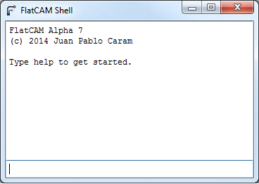

Shell Command Line Interface
============================

.. warning::
    The FlatCAM Shell is under development and its behavior might change in the future.
    This includes available commands and their syntax.

The FlatCAM Shell provides a command line interface to FlatCAM's functionalies
and to the TCL language. It serves the following purposes:

* An alternative to the GUI for issuing commands and visualizing data output.
* Scripting interface for automating large sequences of commands.
* A mechanism for the user to implement new functionality.
* A mechanism to provide detailed information to the user.
* Keep a record of commands and responses.

Calling a Shell script on startup
---------------------------------

A file containing Shell commands (:ref:`cmdreference`) can be executed
when starting FlatCAM from the command line::

    python FlatCAM.py --shellfile=/path/to/file

The Shell Window
----------------

The FlatCAM Shell window is shown at startup when FlatCAM loads. It can be
closed and re-opened at any time without loss of data by clicking on the
close button on the top right edge of the window and selecting
**Tool→Command Line** from the main menu respectively.

It is divided into 2 sections, an output section on the top and an input
section on the bottom. A record of previously issued commands is shown in
the output section along with their results and other information that
FlatCAM might provide. Distinction between types of data in the output
section is done by color coding.

To issue a command, type it in the input section and hit ``Enter``. If the
command consists of multiple lines, use ``Shift-Enter`` to insert a new
line without issuing the command.

Shell Language
--------------

The Shell uses the TCL_ language. TCL provides the simples posible syntax
and requires no learning at all for isuing the basic FlatCAM commands.
Nonetheless, TCL is a powerfull language that enables the users to create
their own complex functionality if desired.

.. _TCL: https://www.tcl.tk/man/tcl8.5/tutorial/tcltutorial.html

Issuing a command is as simple as typing its name and hitting the
``Enter`` key. For example::

    new

This the same as clicking on **File→New** in the main window menu.

If a command requires additional information, it is given immediately
after the command name and a space. For example, to open the gerber
file ``mygerber.gbr``::

    open_gerber mygerber.gbr

Sometimes a command will have optional parameters, this is, if you
provide it it will use it, otherwise it will use some default value.
For example::

    isolate mygerber.gbr -tooldia 0.04

This would create isolation routing geometry for the ``mygerber.gbr``
gerber object with a tool diameter of 0.04 inches (or mm, depending on
the project settings). Otherwise, if you run::

    isolate mygerber.gbr

The same action will be performed but the tool diameter will be taken
from the default value set for that object (If it is a new object, its
default values will be set from the project options.)

For complete reference of FlatCAM Shell commands, see :ref:`cmdreference`.